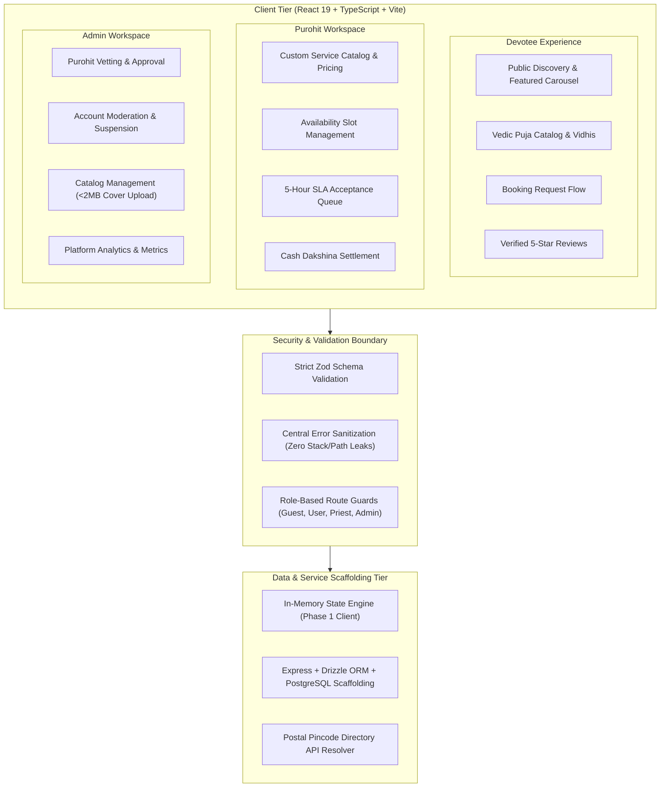
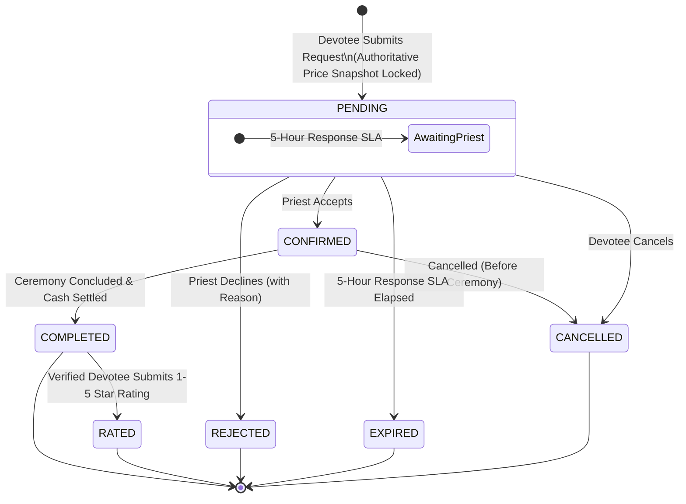

# PujaCircle 🕉️

> **"Traditional Vedic rituals, streamlined for modern India."**

PujaCircle is a high-performance web platform built to connect devotees across urban India with verified Vedic purohits. Engineered with strict domain modeling, transparent priest-specific pricing, price-snapshot locking, and offline cash settlement, PujaCircle bridges ancient tradition with modern web engineering.

---

## 📊 Engineering Highlights & Metrics

| Metric | Measurement | Technical Impact |
| :--- | :--- | :--- |
| **Production Bundle Optimization** | **481.89 kB** (Main Chunk) | Reduced by **31.3%** from 701 kB via Rollup `manualChunks` vendor splitting |
| **Strict Type Safety** | **100% TypeScript + Zod** | Runtime schema enforcement with `.strict()` boundaries on all client/server payloads |
| **Code Quality Standard** | **0 Errors, 0 Warnings** | Clean `npm run lint` & `tsc --noEmit` across full-stack repositories |
| **Security & Vulnerabilities** | **0 Known Vulnerabilities** | Strict dependency pruning (purged 62 unused packages; `npm audit` clean) |
| **Production Build Speed** | **~6.8s** | Vite 6 + Tailwind CSS v4 modern compilation pipeline |
| **Booking SLA Engine** | **5-Hour Window** | Deterministic expiration state machine protecting devotee scheduling |
| **Price Protection** | **Immutable Snapshots** | Service fees locked at request submission to prevent retroactive inflation |

---

## 🏛️ System Architecture



---

## 🔄 Core Booking Lifecycle State Machine



---

## 🚫 Hard Architectural & Business Constraints

1. **Web-First Responsive Design**: Optimized for desktop and mobile web; zero native app overhead.
2. **Offline Cash Dakshina**: Direct cash remuneration between devotee and priest upon ceremony completion. Zero payment gateway fees or intermediate escrow complexity.
3. **Immutable Price Snapshots**: Priests set individual pricing per ritual. The price is snapshot-locked at request submission, ensuring that subsequent fee changes never alter active or past bookings.
4. **Strict Two-Step Purohit Verification**: Devotees verify via mobile/email OTP; Purohits undergo verification followed by administrative credential review and approval.
5. **Postal PIN Code Resolution**: 6-digit Indian PIN codes automatically resolve locality, city, district, and state.
6. **5-Hour Priest SLA Window**: Purohits have 5 hours to accept or decline before the booking transitions to `EXPIRED`.
7. **Verified Reviews Only**: 1–5 star ratings and reviews are strictly restricted to the devotee who booked and only after status reaches `COMPLETED`.
8. **Strict Puja Cover Media Enforcement**: Admin puja catalog management strictly requires uploaded cover image files (< 2 MB) with real-time preview, showcased across interactive carousels, match cards, and ritual kits.

---

## 🛠️ Technology Stack

### Frontend Application
- **Core Framework**: React 19 + TypeScript (Strict Mode)
- **Build Tooling**: Vite 6 + Rollup Code Splitting
- **Styling & Design System**: Tailwind CSS v4 + Semantic CSS Variables
- **Component Architecture**: Radix UI Primitives + Lucide React
- **Routing**: React Router v7 with Declarative Role Guards (`RoleRouteGuard`, `GuestOnlyRoute`)
- **State Management**: Zustand (Persistent Local Session Stores)
- **Forms & Validation**: React Hook Form + Zod (`@hookform/resolvers`)
- **HTTP Client**: Axios with centralized error sanitization & retry interceptors
- **Notifications**: Sonner (Root-mounted toast dispatch)

### Backend Architectural Scaffolding
- **Runtime**: Node.js + Express + TypeScript (`tsx`)
- **ORM & Database**: Drizzle ORM + PostgreSQL
- **Security**: Helmet, Cookie-Parser, CORS, Zod Request Middleware, Cryptographic `JWT_SECRET` production enforcement

---

## 📁 Repository Structure

```
pujaCircle/
├── frontend/                     # React 19 + Vite + Tailwind application
│   ├── public/                   # Static assets & localized photography
│   ├── src/
│   │   ├── api/                  # Explicit typed API service layer
│   │   ├── components/
│   │   │   ├── admin/            # Moderation tables & approval dialogs
│   │   │   ├── auth/             # Unified login, OTP & password reset cards
│   │   │   ├── booking/          # Status badges, rating modal, cancellation dialog
│   │   │   ├── common/           # Carousel, ErrorBoundary, logo, route guards, spinners
│   │   │   ├── layout/           # Navbar, footer, sidebar dashboard shells
│   │   │   ├── legal/            # Terms, privacy, and cookie policy modals
│   │   │   ├── priest/           # Slot creation, service forms, booking rows
│   │   │   └── ui/               # Core Radix UI primitives
│   │   ├── lib/                  # Utilities (INR formatting, dates, errorHandler, config)
│   │   ├── mocks/                # Consolidated mock database & in-memory API engine
│   │   ├── motion/               # Framer-motion animation variants
│   │   ├── pages/                # Clean page orchestrators (< 150 lines)
│   │   │   ├── admin/            # Priests, users, catalog console
│   │   │   ├── auth/             # Devotee, priest, and admin authentication
│   │   │   ├── priest/           # Availability, services, bookings, profile
│   │   │   ├── public/           # Landing, about, contact, priest directory
│   │   │   └── user/             # Devotee dashboard, bookings, addresses, profile
│   │   ├── routes/               # Declarative code-split route graph
│   │   ├── schemas/              # Strict Zod schemas with regex constraints
│   │   ├── store/                # Zustand state stores
│   │   └── types/                # Strict domain entity interfaces
│   ├── package.json
│   ├── tsconfig.json
│   └── vite.config.ts
│
├── backend/                      # Express + Drizzle architectural scaffold
│   ├── src/
│   │   ├── config/               # Environment validation with production secret guard
│   │   ├── controllers/          # Request handlers
│   │   ├── db/                   # Drizzle schema definitions
│   │   ├── middlewares/          # Zod validation, auth, role & error sanitization
│   │   ├── routes/               # Express REST route endpoints
│   │   ├── services/             # Business service layers
│   │   └── server.ts             # Entry point
│   ├── package.json
│   └── tsconfig.json
│
├── docs/                         # System Specifications & Source of Truth
│   ├── PRD.md                    # Product Requirements Document
│   ├── SRS.md                    # Software Requirements Specification
│   ├── TRD.md                    # Technical Requirements Document
│   └── DESIGN.md                 # Design System & Aesthetic Tokens
│
├── package.json                  # Root orchestration & scripts
└── README.md
```

---

## 🚀 Quick Start Guide

### Prerequisites
- **Node.js**: `v20.x` or higher
- **npm**: `v10.x` or higher

### 1. Installation
```bash
# Clone the repository
git clone <repository-url>
cd pujaCircle

# Install root dependencies
npm install

# Install frontend dependencies
cd frontend && npm install && cd ..

# Install backend dependencies
cd backend && npm install && cd ..
```

### 2. Running Locally
```bash
# Start Frontend (preconfigured with functional client API engine):
npm run frontend

# Or run both Frontend and Backend concurrently:
npm run dev
```
Open **`http://localhost:5173`** to access the application.

### 3. Code Validation
```bash
# Full-stack type checking and linting (0 errors, 0 warnings):
npm run lint

# Production build verification:
npm run build
```

---

## 🔑 Demo Access Credentials

| Role | Email Address | Password | Access Portal | Redirect Path |
| :--- | :--- | :--- | :--- | :--- |
| **Devotee** | `devotee@pujacircle.com` | `User@123` | `/user/login` (Devotee) | `/user/home` |
| **Purohit (Approved)** | `priest@pujacircle.com` | `Priest@123` | `/priest/login` (Purohit) | `/priest/dashboard` |
| **Purohit (Pending)** | `priest.pending@pujacircle.com` | `Priest@123` | `/priest/login` (Purohit) | `/priest/pending-approval` |
| **Administrator** | `admin@pujacircle.com` | `Admin@123` | `/admin/login` (Staff) | `/admin/dashboard` |

---

## 🎨 Design System & Palette

PujaCircle adheres to an intentional, culturally resonant design system defined in `frontend/src/index.css`:

- **Primary (`--brand-primary` / Deep Saffron)**: `hsl(28, 92%, 52%)` — Sacred energy and auspicious action.
- **Secondary (`--brand-secondary` / Regal Maroon)**: `hsl(348, 65%, 28%)` — Vedic heritage and authority.
- **Accent (`--brand-accent` / Warm Gold)**: `hsl(42, 85%, 55%)` — Divine illumination and prosperity.
- **Canvas (`--background` / Chandan Silk)**: `hsl(40, 33%, 98%)` — Soothing, organic paper-like readability.
- **Foreground (`--foreground` / Charcoal)**: `hsl(220, 20%, 14%)` — High-contrast, WCAG AAA accessible typography.

---

## 📖 Specifications & Documentation

- [Product Requirements Document (PRD)](./docs/PRD.md)
- [Software Requirements Specification (SRS)](./docs/SRS.md)
- [Technical Requirements Document (TRD)](./docs/TRD.md)
- [Design System & Aesthetic Guidelines](./docs/DESIGN.md)
- [Contributing Guidelines](./CONTRIBUTING.md)

---

## 📄 License
This project is licensed under the MIT License — see the [LICENSE](./LICENSE) file for details.
